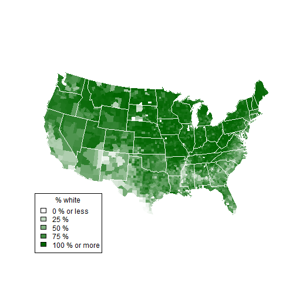

## Census Visualization

1. a sophisticated application that visualizes US Census data
2. Presentation will show you how to load data
3. R Scripts
4. Output

--- 

## counties.rds

1. counties.rds is a dataset of demographic data for each county in the United States
2. collected with the UScensus2010 R package
3. You can download it here [http://shiny.rstudio.com/tutorial/lesson5/census-app/data/counties.rds]

---  

## Dataset| counties.rds

1. the name of each county in the United States
2. the total population of the county
3. the percent of residents in the county who are white, black, hispanic, or asian


```r
counties <- readRDS("C:\\DEP\\DevelopmentDataProducts\\SlidifyPreset\\data\\counties.rds")
head(counties)
```

```
##              name total.pop white black hispanic asian
## 1 alabama,autauga     54571  77.2  19.3      2.4   0.9
## 2 alabama,baldwin    182265  83.5  10.9      4.4   0.7
## 3 alabama,barbour     27457  46.8  47.8      5.1   0.4
## 4    alabama,bibb     22915  75.0  22.9      1.8   0.1
## 5  alabama,blount     57322  88.9   2.5      8.1   0.2
## 6 alabama,bullock     10914  21.9  71.0      7.1   0.2
```


--- 

## helpers.R

1. helpers.R is an R script that can help you make choropleth maps
2. A choropleth map is a map that uses color to display the regional variation of a variable.
3. In our case, helpers.R will create percent_map, a function designed to map the data in counties.rds
4. helpers.R uses the maps and mapproj packages in R.


```r
library(maps)
library(mapproj)
source("C:\\DEP\\DevelopmentDataProducts\\SlidifyPreset\\helpers.R")
counties <- readRDS("C:\\DEP\\DevelopmentDataProducts\\SlidifyPreset\\data\\counties.rds")
```


--- .class #id 

##  Census Visualization- Application


```r

percent_map(counties$white, "darkgreen", "% white")
```

 


--- .class #id 


